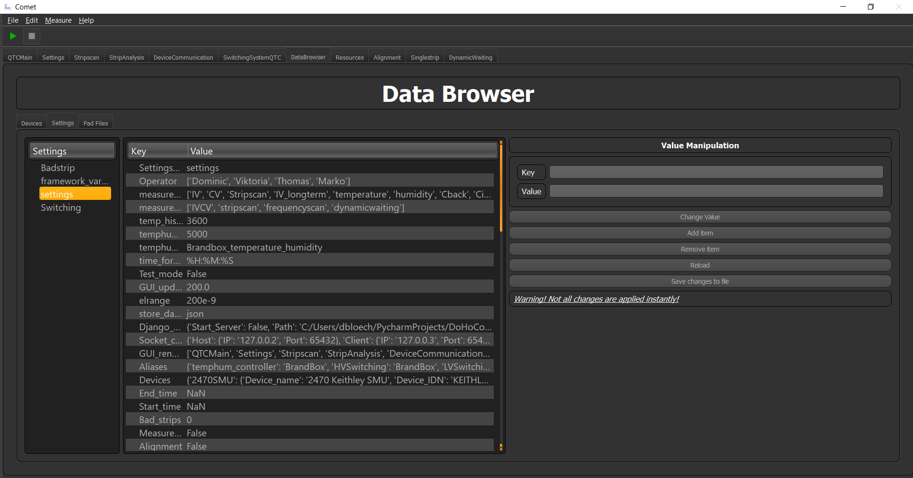

Data Explorer
=============

The data explorer lets you explore all configs you have in your project and (to some extend) manipulate it inside your
running program.

.. caution:: I would not recommend you to change any parameters during a session since this can make the program unstable and can lead to crashes or dangerous configurations.

