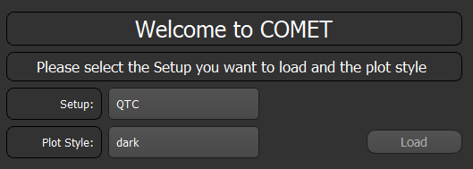
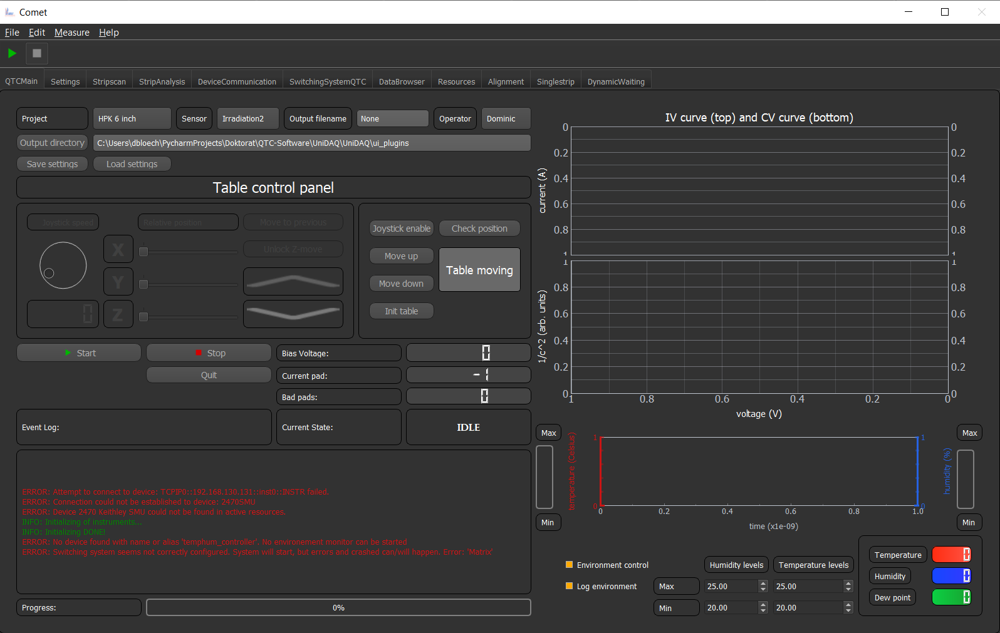
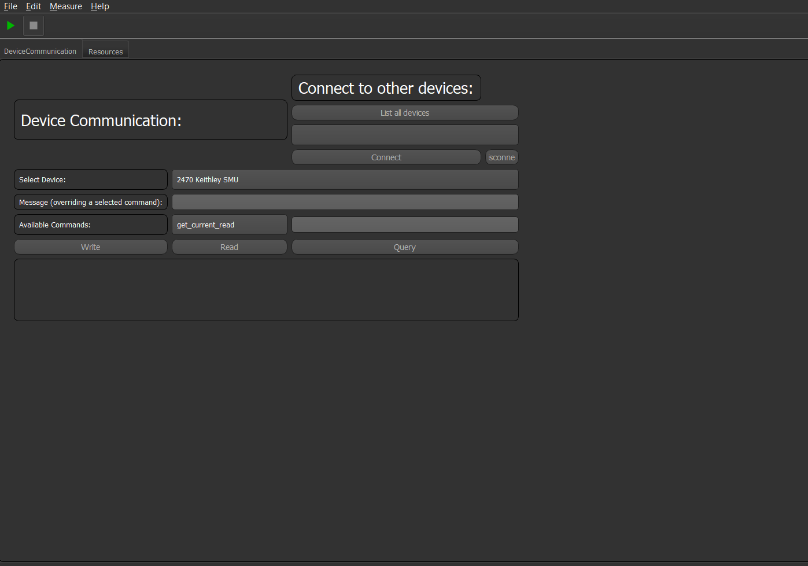

Getting Started
===============

In order to run this program you need a Python Anaconda distribution and the NI-Visa drivers.
For more information on how to install see the :ref:`installation` guide.

Running/Initializing The Program
~~~~~~~~~~~~~~~~~~~~~~~~~~~~~~~~

Now it should be possible to run the program by: ::

    python UniDAQ.py

If you do not have Anaconda installed, start the program via ::

    python main.py

.. note:: If you running COMET in a normal python distribution you have to install all modules by hand. No environment will be set up for you. For needed modules see the requirements.yml file.

.. warning:: If you run into a problem like, python does not find the environment, python was not recognised or a module cannot be found. Make sure the Anaconda python is accessible from the command prompt.

If something does not work out as planned try to test if everything was correctly installed on your system. Just follow
the instructions on :ref:`Once installed, test`

If everything has worked you should see a GUI pop up, which (depending on which GUI version you have) should something look like
this.

It asks you which GUI/setup config you want to load. Just choose one and press load and the framework will load the selected setup.
After that the main GUI should pop up. Depending on which setup you selected you should see something like:

.. note:: This GUI selection window will only appear at first start up. Next time you start the software the PC knows which setup you initially loaded and will automatically load this setup. If you want to load another setup you have to pass the cmd argument "--reinit" when starting the script. Or inside the program, navigate to "Edit/Preferences" and choose the setup you want to load.

.. note:: In order to add your own setups to this list, please see the chapter :ref:`Getting Started`. There everything is explained in detail.

Your first GUI
~~~~~~~~~~~~~~

Now that you can start the software we can create your first GUI with some basic features.
To do so we have to create a new project. This can be done in the sub-folder ``~\config\Setup_configs`` if you create a new directory.
inside this directory create a "settings.yml" file with the following content: ::

    --- # Block of dict entries

    # Critical parameters
    Settings_name: settings

after that restart the software with the cmd parameter ``--reinit`` and select the your project. Now an empty GUI should disappear.

.. note:: You can alternatively copy the project ``Empty_Project`` and rename it to your liking

This GUI is basically capable of doing nothing. To change that we have to add some GUI elements to it.
COMET comes with a plugin approach for GUI elements. To add a GUI simply add the entry: ::

    GUI_render_order:
        - DeviceCommunication
        - Resources
        - DataBrowser

to the ``settings.yml`` file. This will add the DeviceCommunication, Resources and Data Browser tab to your GUI. Which are stand alone
multipurpose GUI elements and nice to have for every GUI you create.

The **DeviceCommunication** tab shows you every device connected to the software or lets you connect to every device and then sent commands to the device.

The **Resources tab** will -for now- be empty, since you have not configured any devices yet. If you have done that all devices will be
shown there and their stats as well if they are connected or not.

The **DataBrowser** tab will show/let manipulate you all values of the state machine and the configs for the connected devices.

Your first device
~~~~~~~~~~~~~~~~~

In order to add a device to the software, you can add the entry: ::

    Devices: # Name of the config entry
      2470SMU: # Some descriptor for the device
        Device_name: 2470 Keithley SMU  # Name of the device, this must be the same name as of one in the device library                                                                # The actual device name from which it should get all commands
        Device_IDN: KEITHLEY INSTRUMENTS,MODEL 2470,04424944,1.6.8d
        Connection_type: IP:TCPIP0::192.168.130.131::inst0::INSTR

.. note:: Don't panic! If you do not understand everything now what all this means. In the following chapters (:ref:`Add a new device`) the correct and in depth explanation is written.

If you now restart the Software and change to the Resources tab you should see an entry for this device.

.. image:: pictures/Resources.png
   :alt: Flowchart_main
   :class: floatingflask

