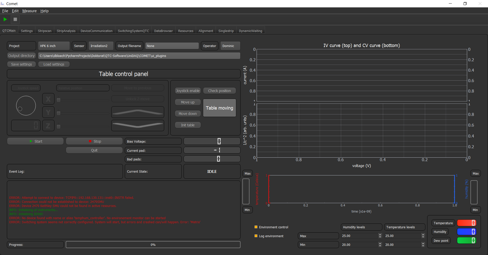
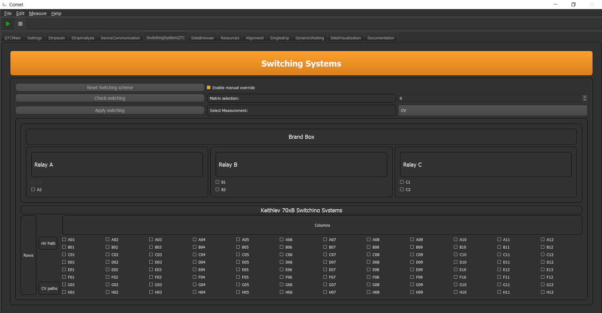

IVCV
====

The IVCV plugin is a plugin for conducting Current-Voltage and a Current-Capacitance measurement. This GUI looks in its
simples version like this:



In the top part of the GUI you can select the Project, Sensor, Operator and choose the file name the output file should
have. Furthermore, you can choose the directory of the output, by either typing the path or by choosing via the button.

With the Buttons **Load all settings** load a predefined measurement setting. Choose the one which is best suited for
the IVCV measurement you want to make.

If you want to define the measurement parameter yourself you have to change to the **MeasurementConfig** tab. In there
you can enable the IVCV meausrement and choose the measurement parameters for IV CV and the voltage step refinement yourself.
You also can decide to switch on or off either the IV or CV measurement all together.

The voltage step refinement option lets you refine the step size in a specific region of the IVCV ramp. This is especially
useful, if you want to investigate the behavior near the full depletion point, but you do not want the small step-size for the
whole measurement, to safe time.

.. note:: You can choose different bias voltages for CV or IV measurement. So stop the CV measurement at 400 V but the IV measurement should continue to 1000 V. Or vice versa.

If the parameters are set to your liking you can go back to the **QTCMain** tab, and save your setting by clicking on the
**Save current settings** button. Then you will be prompted to save you settings.

.. note:: If you want to have this settings detected automatically when reloading you have to save the settings under ```COMET\config\Setup_configs\QTC\Measurement_Settings```

In order to acquire correct values for the CV measurement the LCR-Meter has to be calibrated with an open correction.
To do that you have to uncontact all needles from any sensor. Afterwards you have to select the tab **SwitchingSystemQTC**
which looks like:



To the right you can see the option **Select Measurement**, here you have to select the option **CV** and then hit the
button **Apply switching**. If this is done you can do the open correction on the LCR-Meter and when this is done hit
the button **Reset Switching scheme**.

.. note:: If you are doing several IVCV measurements in succession you only have to do the calibration once for the runs.

Now you can place the sensor on the chuck and contact the needles.

On the right side of the GUI you see two plots, which will be populated if a measurement is conducted in IV/CV mode.
Below that is the environment control which starts running on start up. Here you can choose the humidity and temperature levels/regions during measurement.

.. important:: If the environment levels are not reached, COMET will wait for the environment to reach these levels before it proceeds with the measurement.

If all is set to your liking you can hit the **Start** button or the **Play** button in the top and the measurement will
automatically start. In the event log you can follow the progress and also see if something is missing and if error happend.