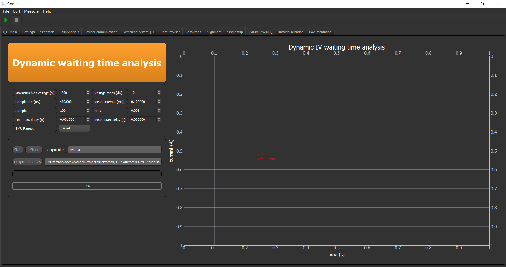

Relaxation Time Analysis
========================

The Relaxation time analysis, does in principle, a time dependent IV curve. You can configure the basic IV parameters
and further the parameters for the "fastness" of IV readings of the SMU.

* **Meas. interval [ms]** - Measurement interval, this can be used to artificially prolong the overall time
* **Samples** - How many samples you want to record
* **NPLC** - A device specific value which gives the Number of Power Line Cycles. The range is device specific. But smaller values makes the measurement faster.
* **Meas. start delay [s]** - Time delay after setting a voltage step, before the measurement begins
* **Fix meas delay [s]** - Artificial delay between every measurement
* **SMU Range** - MAXIMUM range of the current AUTO range

The other buttons should be self explanatory

.. important:: The total measurement time cannot be easily determined, since it is dependent on the devices capabilities. The easiest way is to try it out, until you have the desired length. But as a rule of thumb you can multiply the samples with all delays. Then you have roughly an estimation of the recorded time.