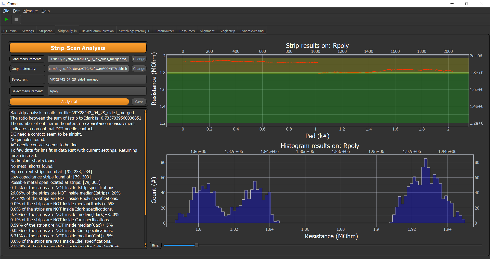
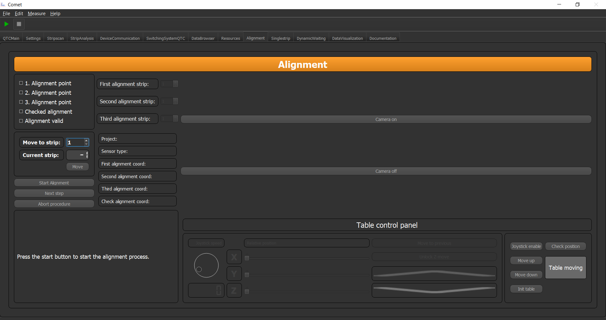

Stripscan
=========

The Stripscan GUI is only a presenter of the data recorded by measurement plugin. It displays you all conducted measurements
as well as some statistics and current values of the individual measurements. To start a Stripscan measurement you need to
configure it correctly in the settings tab (see below), and then start it over the Main GUI via the start button.

.. image:: ../pictures/StripscanGUI.png
   :alt: Flowchart_main
   :class: floatingflask

The settings tab to configure the stripscan parameters are shown below. Basically you have to have checked the corresponding
radio button and then each individual measurements radio button you want values from.
Each measurement hast three parameters.

* Measure every - Measure every n-th pad position
* Start strip - The n-th pad position the measurement will start
* End strip - The n-th pad position to stop the measurement

.. image:: ../pictures/QTCSettings.png
   :alt: Flowchart_main
   :class: floatingflask

Bad Strip Detection
~~~~~~~~~~~~~~~~~~~

After a successful measurement you usually want to know about bad strips and the general condition of your results/sensor.
Therefore, there is a Bad Strip Detection GUI, in which you can load several measurement files and analyse them with the
bad strip detection algorithm.

After loading the measurements you can press **Analyse all** and the script will do its magic. It then shows you for each
measurement and each parameter the results. The top plot shows you the data and the supposed boundaries. The green region
is the supposed region where the data should be and the yellow region shows you the meadian of the data +- a few precent.

.. note:: The data/sensor is good, if the data points are inside the green and the yellow regions. Otherwise something is not correct.

The second plot shows you a histogram representation of the data. With the bin scroller you can adjust the binning.

On the left side you get the verbose output of the analysis with further information on strip parameters and the faults.

Alignment Procedure
~~~~~~~~~~~~~~~~~~~

In order to make a connection from your table coordinate system to the one your sensor has you need to tell the framework
how to do so. This can easily be done via the **Alignment** tab shown below:

If you have selected an Sensor in a Project in the Main Tab you can hit the button **Start Alignment** the GUI will display
all important information about the project and the sensor again, as well as the alignment pads you designated in the configs.
If you are not content with them, you can change them via the spin boxes.

.. important:: On how to config a specific Project/Sensor for this procedure please see :ref:`Sensor Files`.

The text field below will guide you through the alignment procedure, please follow the steps stated there to successfully
align your sensor.

Furthermore, the widget has the ability to communicate with a camera attached to the microscope, to check the status of the
needles via a camera. Simply switch on the camera if you want.

The bottom widget is the table control widget you know from the main tab. With it you can do the same table manipulations like
in the main tab.

Sensor Files
~~~~~~~~~~~~

Since the Stripscan  GUI is relying on the xyz stage you need to have a pad file with the corresponding pad positions. When you start
the Alignment plugin the data gets converged to an easy accessible pad file structure. For this to work you need a ``Pad_files`` folder
within your project description folder. Inside has to be folders which are project descriptors and inside that are ``.txt`` files
containing the pad positions

A possible structure could be ::

    │   badstrip.yml
    │   framework_variables.yml
    │   settings.yml
    │   switching.yml
    │
    └───Pad_files
        ├───HPK 6 inch
        │       Irradiation2.txt
        │
        ├───HPK 6 inch 2018
        │       2S.txt
        │       PSlight_notcorr.txt

This will generate the projects **HPK 6 inch** and **HPK 6 inch 2018** with the corresponding files in it.

In these files general information about the Sensor  are stored as well as optional location information.
This location information are for automated test in the probe station. These additional folder will be interpreted as different projects you are working on. (See accessing the data section below).

Such a Pad file can looks like this:

.. code-block:: python

   Campaign: Hamamatsu 6inch Irradiation
   Creator: Dominic Bloech 17.07.2018

   reference pad: 1
   reference pad: 32
   reference pad: 64

   # Additional parameters
   implant_length: 20036
   metal_width: 35
   implant_width: 22
   metal_length: 19332.35
   pitch: 90
   thickness: 240
   type: p-type

   strip	x	y	z
   1	    0	0	0
   2	    0	90	0
   3	    0	180	0
   4	    0	270	0
   5	    0	360	0
   6	    0	450	0
   7	    0	540	0
   8	    0  	630	0
   9	    0	720	0
   10	    0	810	0
   11	    0	900	0
   12	    0	990	0
   13	    0	1080	0
   14	    0	1170	0

In the first few lines of text the header is defined. Each line with a '#' is considered to be a comment line. The other
lines having a semicolon represent a item type variable for additional information. Non of these parameters in the header
are mandatory and you also can extend these parameters. How you use it in your workflow is to your liking.

If you want to make automated measurements in a probe station least three parameters of type ``reference_pad: xyz``.
These specify (if correctly implemented) the three points/pad numbers for the coordinate transformation.

.. note:: This structure is implemented as a plugin, if you write your own plugins for the alignment you can exchange this mechanism with one you like!

The second part of this file are coordinates. Here the starting line is ``strip	x	y	z``. This line HAS to start with
the word strip, otherwise the program will not know where the coordinates start. (Except you teach the program to).

.. note:: You can add more parameters if you want, e.g. an angle or so.

After that the program reads in the data separated by tabs or spaces in a list of lists. See accessing data part for clarification.

Accessing Pad data
******************

The corresponding data structure is called ``pad_files_dict``. The type of this structure is again a dictionary containing
as items the different folders in the ``Pad_files`` folder. These are as mentioned before interpreted as some kind of
projects you have. Inside those folders are then the individual pad files.

The accessing scheme is a hierarchical one. Meaning the keys of ``pad_files_dict`` are the names of the project aka. folder
names. Inside the value to this key you find yet again a dictionary with the keys being the individual sensors. Inside those
you find also a dictionary with the keys ``reference_pads``, ``header``, ``data`` and ``additional_params``.

    * The ``reference_pads`` entry contains the pad and the locations of the defined reference pads
    * The ``header`` entry contains the whole header
    * The ``additional_params`` entry contains the parameters of the header with : as dictionary
    * The ``data`` entry is a list of the length of the coordinate lines in the pad file. Each list entry is another list, containing the tab or space separated values form the coordiante section of the pad file.

Wow, a lot of dictionaries and list, to clarify a small example how you access data.

.. code-block:: python

    xcor = pad_files_dict["My_project"]["Sensor_1"]["data"][2][1] # Will be 0
    ycor = pad_files_dict["My_project"]["Sensor_1"]["data"][2][2] # Will be 90
    zcor = pad_files_dict["My_project"]["Sensor_1"]["data"][2][3] # Will be 0

    metal_width = pad_files_dict["My_project"]["Sensor_1"]["additional_params"]["metal_width"] # Will be 35

.. warning:: Be careful while accessing data from the dictionaries, if the key does not exist python will say No and the program stops. So make sure you check the availability before accessing!!!