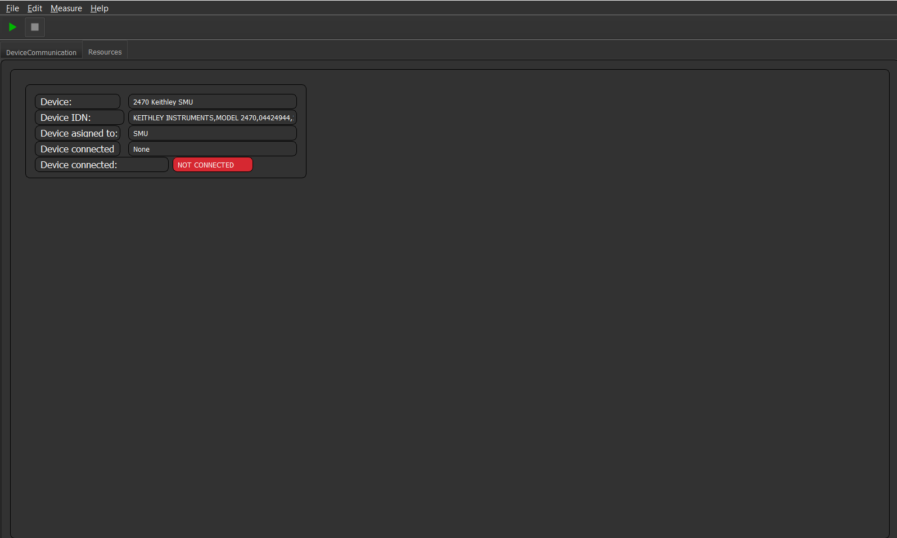

How to
======

These tutorials will guide you through the process of generating your own own customized GUI and measurement routines.
Furthermore, it will guide you through the process to create and add new physical measurement devices.

Before we can start, please follow the steps in chapter :ref:`Your first GUI` and create an empty new Project with the name of your liking.

Add a GUI element
-----------------

Your program has - most likely - no productive GUI elements at all, if its want you wanted: *Awesome*. If not, we ought to change that.
In order to do so we need to design a GUI first.

COMET can work with **QTDesigner** ``.ui`` files.
With the :ref:`installation` of this software, which you have followed I hope, the so-called QtDesigner was installed as well.
If features a simple GUI based program, in which you can generate your own GUI and save them in ``.ui`` format.

.. note:: You can normally find the QTDesigner in your install directory of python under the QT directory in the lib. And I will not go into details on how you build GUIs in QtDesigner, there are plenty of tutorial videos in the web.

When your GUI element is finished save it in the directory ``.COMET/QT_Designer_UI``. Now COMET can access them easily.

The next step is to tell the Program to render this UI. Open the ``settings.yml`` in your project folder and
add in the parameter ``GUI_render_order`` with a list value of ``<YourCoolGUI>``. ::

    GUI_render_order:
        - YourCoolGUI
        - DeviceCommunication
        - Resources
        - DataBrowser

Unfortunately this is not all. We know have to write some code to tell the framework that we want to render this ``.ui`` file you have just created.
For this we generate a file in the directory ``.COMET/ui_plugins``. This file you have to call ``<YourCoolGUI>_window.py``.

.. note:: It is important, that you add the suffix ``_window`` to your python file, this makes it clear for the framework, that this is a window and treads it as one. All other files will be ignored and cannot be added this way!

Inside your python GUI plugin you have to direct the framework what to do.
The minimal example to run just the GUI without anything else is as follows: ::

    from PyQt5 import QtGui
    from PyQt5.QtGui import *
    from PyQt5.QtWidgets import *
    import logging

    class <YourCoolGUI>_window:
        def __init__(self, GUI_classes, layout):
            self.variables = GUI_classes    # Containing all variables and methods from the parent class for example the state machine
            self.layout = layout            # The layout class in which will be rendered
            self.log = logging.getLogger(__name__) # This is optional, but you do want to write to the logger

            # Loading the UI plugin
            <YourCoolGUI>_widget = QWidget()
            self.<YourCoolGUI> = self.variables.load_QtUi_file("./COMET/QT_Designer_UI/<YourCoolGUI>", <YourCoolGUI>_widget)
            self.layout.addWidget(<YourCoolGUI>_widget)

After that it renders the GUI when you restart COMET. But this code does not have and logic to it. You can add python
member functions to it. To access the ui classes from your GUI e.g. buttons and so on, you have to do it via ``self.<YourCoolGUI>.foo()`` etc.

If you restart COMET you should see a window tab called "<YourCoolGUI>". Wow, what an achievement!
Now that we know how to add some GUI elements to our program we can proceed and add some devices too.

Add a new device
----------------

Before we start with this tutorial make sure you have added the "Resource" tab to your GUI as described in the previous chapter or in the chatper :ref:`Your first GUI`.
This will make it easy to see if a new device was added or not.

Now that we have a GUI which can display all devices in the framework, we should add a device and see what happens.
To do so add the line: ::

    Devices: # Name of the config entry
      <Device_descriptor>: # Some descriptor for the device
        Device_name: <A Device name>  # Name of the device, this must be the same name as of one in the device library                                                                # The actual device name from which it should get all commands
        Device_IDN: <IDN of your specific device>
        Connection_type: <Connection type>

The top entry **Devices** is a mandatory entry which tells the software that the following entries are devices.
The sub-entries are up to your liking, but this will be the name of the internal representation of the device object in the software!

The entires:
   * Device_name
   * Device_IDN
   * Connection_type

are mandatory for eacht sub-entries. You can extend this list as you like, the main framework will ignore them, but if you do need some additional parameters which cannot
be configured in the main device config, knock yourself out.

.. note:: If you have a RS232 device connected you can add the ``Baud_rate`` parameter and change the default baud rate for the device. This also holds true for other RS232 parameters. For more information see, the device connection API reference for more information.

**Connection_type** is a parameter which tells the framework what kind of connection the device listens to and at what port.
Possible options are:
   * RS232:<ComPort>
   * GPIB:<Address>
   * IP:<IP_INSTR_descriptor>

If you then start the COMET software with your project selected. The device should appear in the resources tab. Depending if
the device is connected to the PC the connection lamp should switch to green, which means that the software has successfully established
a connection to the device and everything was configured correctly.

.. note:: Most often, if you experience connection difficulties the Device_IDN is not completely correct entered.

The result schould lool like this:

COMET furthermore knows the concept of alias names for devices.
This enables you to have an easy way to relabel devices and assign devices to more than one task. Imagine you have a device which
does some switching and can monitor the environment as well. Either you load the device twice with a different name and so on. Or you
assign an alias e.g. 1) "HV Switching" and 2) "Humidity Monitor" to the device. For the user it then looks like two devices but internally its the same device.
This prevents async. read and write operations to the device and makes it more robust.

To tell COMET to assign a alias to on device have a look at a specific example: ::

   # Devices aliases for internal use, the key will then be the frameworks internal representation and the value is the display name
    Aliases:
        temphum_controller: BrandBox
        HVSwitching: BrandBox
        BiasSMU: 2470 Keithley SMU
        lights_controller: BrandBox

    Devices:
        2470SMU:
            Device_name: 2470 Keithley SMU
            Device_IDN: KEITHLEY INSTRUMENTS,MODEL 2470,04424944,1.6.8d
            Connection_type: IP:TCPIP0::192.168.130.131::inst0::INSTR

        BrandBox:
            Device_name: BrandBox
            Connection_type: RS232:15
            Device_IDN: HV-Relay Controller V1.6/18.Apr.2019

In this case the device "2470 Keithley SMU" will be renamed to "BiasSMU" and the device "BrandBox" will become the devices
"temphum_controller", "HVSwitching", and "lights_controller". Which internally, e.g. in your measurement plugin can directly be addressed with these names.

Create a new device
-------------------

COMET ships with a large variety of different devices which have been preconfigured for easy use.
If you have a device which is not listed you have to add this device to the lib. To do so look in the directory, ``configs\device_lib``.
There you can add your device as as ``.yml`` styled file. You can choose the name of the file as you see fit. As long it does not
interfere with another name in the same directory.

.. note:: The software only accepts ``.yml`` files, all other files will be ignored.

Inside such a device file you can set a multitude of parameters. Such a exemplary device file looks as follows: ::

   ---
   Device_name: 2470 Keithley SMU   # Device name, the name you have to state in the settings file
   Display_name: BiasSMU # Some easy to read name for the user
   Device_type: SMU # Some descriptor what kind of device it is

   # All set parameters
   set_beep: beeper.beep({}, {})
   set_delay: delay({}) # Sets a delay to to following command!
   set_meas_delay: smu.measure.userdelay[1] = {}
   set_measurement_function: smu.measure.func = {} #  smu.FUNC_DC_VOLTAGE/smu.FUNC_DC_CURRENT/smu.FUNC_RESISTANCE
   set_autorange_current: smu.measure.autorange = {}

   # All get parameters
   get_read:  print(smu.measure.read())
   get_read_current:  print(smu.measure.read())
   get_current_read:  print(smu.measure.read())

   # All reset device parameters
   reset:
      - measurement_function: smu.FUNC_DC_CURRENT
      - current_compliance: 2e-6
      - autorange: smu.ON
      - autozero: smu.ON
      - measurement_count: 1
      - filter_enable: smu.ON

   # Misc parameters
   clear_errors: errorqueue.clear()
   exit_script: exit()
   device_IDN_query: "*IDN?"
   reset_device: ["*rst", "*cls"]
   separator: "," # The separator if queued commands are allowed

In principal you have four different sections in a device file:

   * **Set Parameters**
   * **Get Parameters**
   * **Reset Parameters**
   * **Misc. Parameters**

**Set Parameters:**

These parameters have the prefix ``set_``. This means that these parameters does not expect a response from the device.
They are simple "fire-and-forget", you can not make sure, by simply sending the parameter, the device understood the command.
You may have to send an additional "Get" parameter to ensure successful execution.

**Get Parameters:**

These parameters have the prefix ``get_``. These parameters start a query routine, so first sending the paramerter and then
waiting for an answer from the device. A simple example would be the ``get_read`` command, which gives you a simple reading from the device in most cases

**Reset Parameters:**

COMET has the feature to run an initialization procedure over a device, when the software boots up, or a new measurement is started.
This sets the device in a defined state and makes it easier to debug.
In order to use this feature a format has to be considered for the keys in the dictionary.
In this case you have a dict key ``reset`` followed by a list of commands. These commands need to have, for every key in the list, a
corresponding ``set_<command>``. The value in the reset command will then be inserted in the set command.
To complicated? A short example is in need. Imagine you have the following device config: ::

    ---
    Device_name: SMU   # Device name, the name you have to state in the settings file
    Display_name: BiasSMU # Some easy to read name for the user
    Device_type: Device # Some descriptor what kind of device it is

    # All set parameters
    set_beep: beeper.beep({}, {})
    set_output: sma.output({}) # Sets a delay to to following command!

    # All reset device parameters
    reset:
      - output: smua.ON

As you can see the reset paramerter is ``output: smua.ON`` therefore, the program looks for a ``set_output`` parameter.
If found the value ``smua.ON`` will be passed to the command ``set_output: sma.output({})`` which eventually result in the
command sent to the device: ``sma.output(smua.ON)``. Which in this case switches on the output of the SMU.

**Misc. Parameters:**

These parameters are completely optional, you can give them names as you like, you do not have to set any prefixes or whatsoever.
I personally use these parametes for nice to know/have commands.

.. note:: The only "important" parameter in the Misc. section is the ``reset_device: ["*rst", "*cls"]`` if you have this key in your config file, the software uses the list passed to soft-reset the device. But be aware, the software does not check any of these commands, it just sends them. Its up to you they are correct soft-reset commands!

Device Command Structure
~~~~~~~~~~~~~~~~~~~~~~~~

COMETs device command structure is fairly simple. It uses the python **format** structure to easily be compatible with the large
varitiy of command structures for different measurement devices.

All command files are YAML styled files. And the first order commands are e.g. set, get, reset ... parameters. These, commands
consists of a Key: Value pair. As key, you -basically- can use whatever you want, but I would go with the recommended parameter structure described in this section.
The value to every key is then the basic command for the specific device. If this command needs a variable as input, like:
``set_voltage: smua.levelV = {}`` just put the two curly brackets at the point where to insert value. In the software you can then
send this command via the simple command structure ``vcw.query(BiasSMU, "set_voltage", 100.0)``. BiasSMU is in this case
the device object, containing all information about the device, "set_voltage" is the key and 100.0 the value. This results
in the command send to the device "BiasSMU": ``smua.levelV = 100.0``.

.. note:: If you have several variables to be passed. Like ``set_beep: beeper.beep({}, {})`` you can do ``vcw.query(BiasSMU, "set_beep", 24000, 1)``, and it will result in: ``beeper.beep(24000, 1)``

The functionality how you can send commands is quiet extensive and would expand beyond the topic of this section. Therefore, please see
section ??? for more details.

Add a new measurement
---------------------

In this final tutorial I will show you how to add a measurement plugin as easily as the GUI plugins from the previous section.

Every measurement outputs data, which eventually can be plotted. So before we do anything else we tell the GUI to recognise
the new measurement. This can be done by adding the line: ::

   measurement_types:
      - <measurement_name> # The name of a meas., if a meas. plugin gives you more than one measurement, state all here.

   measurement_order:
      - <name_of_measurement_plugin> # The order implies which meas. plugin is executed before another

To the ``settings.yml`` of our project. This makes it possible to send data from the measurement thread to the GUI thread and the
GUI saves your data. On how to send data exactely from a measurement thread to the GUI see chapters :ref:`The GUI event loop` and :ref:`???`.

Next we need to write our measurement plugin. These plugins need to be stored as ordinary python files in the directory
``COMET\measurement_plugins``. You can name these plugins as you see fit. The important thing is that inside, there is a python
class with the exact same name as the name of the file and it contains AND the suffix ``_class``. The measurement class needs to have a **run** function which starts the actual measurement routine.
Furthermore, the class only becomes one parameter passed during init, this being the measurement event loop instance.

.. footnotes:: The measurement event loop has a large variety of variables and function which you can use for building your own measurement plugin. For more information on that see chapter :ref:`???`

Otherwise there are no real restrictions on how your measurement is working.

.. note:: The whole measurement class will be run in a thread on their own. So make sure to be as thread save as possible when you program it. But you do not need to do anything concerning the thread capabilities of your routine. The framework takes care of that.

Now comes to the fun part, coding the actual measurement procedure.

As an example I show you a simple IV measurement plugin.

.. code-block:: python
   :linenos:

   # This file conducts a simple IV measurement

   import logging
   import sys
   from time import sleep
   import numpy as np
   sys.path.append('../COMET')
   from ..utilities import timeit
   from .forge_tools import tools

   class IV_class(tools): # Every measurement muss have a class named after the file AND the suffix '_class'

       def __init__(self, main_class):
           # Here all parameters can be defind, which are crucial for the module to work, you can add as much as you want
           self.main = main_class
           super(IV_class, self).__init__(self.main.framework, self.main) # Initializes the tool box function, which gives you pre defined functions for ramping etc.
           self.log = logging.getLogger(__name__)
           self.vcw = self.main.framework["VCW"]

           # Get all devices necessary for the measurement
           self.bias_SMU = self.main.devices[self.IVCV_configs["BiasSMU"]]

           # COMET has a sophisticated logging, you can use it
           self.log.info("Init of IV measurement plugin finished...")

       def stop_everything(self):
           """Stops the measurement, by sending a signal to the main loop, via a queue object"""
           order = {"ABORT_MEASUREMENT": True}
           self.main.queue_to_main.put(order) # This is the mechanism to send data to the "GUI"

       def run(self): # The mandatory run function
           """Runs the IV measurement"""
           self.log.info("Starting IV measurement...")
           self.do_IV()
           self.log.info("IV measurement finished...")
           return None

       def do_IV():
            # Does the whole measurement
            voltage_step_list = self.ramp_value(voltage_Start, voltage_End, voltage_steps) # create a voltage list, with a tool box function

            # Config your devices, either use the config_setup from the tool box or individual commands
            self.config_setup(self.bias_SMU, [("set_output", "OFF"), ("set_voltage", 0)])
            self.change_value(self.bias_SMU, "set_compliance_current", compliance)
            self.change_value(self.bias_SMU, ("set_output", "ON"))

            for voltage in voltage_step_list:

               self.log.debug("IV measurement at voltage step: {}...".format(voltage))

               if not self.main.event_loop.stop_all_measurements_query(): # To shut down if necessary, by asking if somewhere the stop signal was send
                  self.change_value(self.bias_SMU, "set_voltage", str(voltage)) # Change the bias voltage and wait until stead state is reached
                  if not self.steady_state_check(self.bias_SMU, self.IVCV_configs["GetReadSMU"], max_slope = 1e-6, wait = 0, samples = 5, Rsq = 0.5, complience=compliance): # Is a dynamic waiting time for the measuremnts
                     self.stop_everything() # If steady state could not be reached send stop signal to framework

                     if self.check_complience(bias_SMU, float(compliance)): # Check if compliance is reached
                        self.stop_everything() # stops the measurement if compliance is reached

                     # Make the measurement
                     command = self.main.build_command(bias_SMU, "get_read") # Gives you the command for a read, Warning: read does not need a parameter, usually this command goes build_command(device_dict, (order, value))
                     current = self.vcw.query(self.bias_SMU, command) # Queries the command from the device

                     # Save the data in the measurement object and send it to the main/GUI
                     self.main.measurement_data["IV"][0] = np.append(self.main.measurement_data["IV"][0], [float(voltage)])
                     self.main.measurement_data["IV"][1] = np.append(self.main.measurement_data["IV"][1],[float(current)])
                     self.main.queue_to_main.put({"IV": [float(voltage), float(current)]})

                     # Write the data to a file if specified
                     if self.main.save_data:
                        string_to_write += str(self.main.measurement_data["IV"][0][-1]).ljust(24) + str(self.main.measurement_data["IV"][1][-1]).ljust(24)
                        self.main.write(self.main.measurement_files["IV"], string_to_write + "\n")

            # Ramp down and switch off SMU
            self.do_ramp_value(self.bias_SMU, "set_voltage", str(voltage_step_list[i-1]), 0, 20, 0.01) # This function automatically builds command
            self.change_value(self.bias_SMU, ("set_output", "OFF"))

.. note:: The mechanics and functions behind the actual measurement procedure is quiet big. Therefore, I will only talk about the here programmed example but note that the framework tool box gives you a ton of functions to work with for measurement algorithm development. Please see for the dedicated tutorials on that.

So lets go through this program in detail:

.. code-block:: python

   # This file conducts a simple IV measurement

   import logging
   import sys
   from time import sleep
   import numpy as np
   sys.path.append('../COMET')
   from ..utilities import timeit
   from .forge_tools import tools

   class IV_class(tools): # Every measurement muss have a class named after the file AND the suffix '_class'

       def __init__(self, main_class):
           # Here all parameters can be defind, which are crucial for the module to work, you can add as much as you want
           self.main = main_class
           super(IV_class, self).__init__(self.main.framework, self.main) # Initializes the tool box function, which gives you pre defined functions for ramping etc.
           self.log = logging.getLogger(__name__)
           self.vcw = self.main.framework["VCW"]

           # Get all devices necessary for the measurement
           self.bias_SMU = self.main.devices[self.IVCV_configs["BiasSMU"]]

           # COMET has a sophisticated logging, you can use it
           self.log.info("Init of IV measurement plugin finished...")

Here basic modules are loaded, you are not restricted to them. You can add and remove as much as you like. The class IV_class is also
stated with the init function. Note that I inherit the **tools** module. It contains a multitude of functions which can help you
build your own measurement plugin. Please see the :ref:`Measurement Tool Box functions` for more information.
To actually use this tool box you have to init it with the ``super`` initiatior as shown above. This makes every function in
the tool box a member of your measurement plugin. Then I initiate the logging and the "Visa Connect Wizard" from the parent class,
passed as variable to the measurement plugin.

In the end I create a variable, containing the bias SMU so I can easily access it.

The next part are some member functions:

.. code-block:: python

   def stop_everything(self):
      """Stops the measurement, by sending a signal to the main loop, via a queue object"""
      order = {"ABORT_MEASUREMENT": True}
      self.main.queue_to_main.put(order) # This is the mechanism to send data to the "GUI"

   def run(self): # The mandatory run function
      """Runs the IV measurement"""
      self.log.info("Starting IV measurement...")
      self.do_IV()
      self.log.info("IV measurement finished...")
      return None

The ``stop_everything`` function is a message function to the main loop of the framework. It directs the framework to stop
all measurements, this can come in handy if you reach the compliance and want to stop the measurement.

The other function is the ``run`` function. This is a crucial function, every measurement plugin needs to have. In it you
should put the mechanics to start the measurement and end it correctly. In this specific case it does not do much, except
writing to the log file and call another function:

.. code-block:: python

   def do_IV():
            # Does the whole measurement
            voltage_step_list = self.ramp_value(voltage_Start, voltage_End, voltage_steps) # create a voltage list, with a tool box function

            # Config your devices, either use the config_setup from the tool box or individual commands
            self.config_setup(self.bias_SMU, [("set_output", "OFF"), ("set_voltage", 0)])
            self.change_value(self.bias_SMU, "set_compliance_current", compliance)
            self.change_value(self.bias_SMU, ("set_output", "ON"))

            for voltage in voltage_step_list:

               self.log.debug("IV measurement at voltage step: {}...".format(voltage))

               if not self.main.event_loop.stop_all_measurements_query(): # To shut down if necessary, by asking if somewhere the stop signal was send
                  self.change_value(self.bias_SMU, "set_voltage", str(voltage)) # Change the bias voltage and wait until stead state is reached
                  if not self.steady_state_check(self.bias_SMU, self.IVCV_configs["GetReadSMU"], max_slope = 1e-6, wait = 0, samples = 5, Rsq = 0.5, complience=compliance): # Is a dynamic waiting time for the measuremnts
                     self.stop_everything() # If steady state could not be reached send stop signal to framework

                     if self.check_complience(bias_SMU, float(compliance)): # Check if compliance is reached
                        self.stop_everything() # stops the measurement if compliance is reached

                     # Make the measurement
                     command = self.main.build_command(bias_SMU, "get_read") # Gives you the command for a read, Warning: read does not need a parameter, usually this command goes build_command(device_dict, (order, value))
                     current = self.vcw.query(self.bias_SMU, command) # Queries the command from the device

                     # Save the data in the measurement object and send it to the main/GUI
                     self.main.measurement_data["IV"][0] = np.append(self.main.measurement_data["IV"][0], [float(voltage)])
                     self.main.measurement_data["IV"][1] = np.append(self.main.measurement_data["IV"][1],[float(current)])
                     self.main.queue_to_main.put({"IV": [float(voltage), float(current)]})

                     # Write the data to a file if specified
                     if self.main.save_data:
                        string_to_write += str(self.main.measurement_data["IV"][0][-1]).ljust(24) + str(self.main.measurement_data["IV"][1][-1]).ljust(24)
                        self.main.write(self.main.measurement_files["IV"], string_to_write + "\n")

            # Ramp down and switch off SMU
            self.do_ramp_valueself.bias_SMU, "set_voltage", str(voltage_step_list[i-1]), 0, 20, 0.01) # This function automatically builds command
            self.change_value(self.bias_SMU, ("set_output", "OFF"))

Here the actual tasks for the IV curve is programmed. It shouldn't be hard to deceiver it and understand how it works.

If you start a measurement, COMET generates a numpy array for every measurement in which you can store your data.
This variable is called ``self.main.measurement_data`` and is a dict with keys being the different measurements possible.
It is the same type of array a the GUI one. So you can keep track of your data, without worrying to much about it.

One important thing is the automatic "write-to-file" capabilities of COMET, if you have correctly send a job to the framework
it generates you a file in which you can easily write. To do so you have to access the write method from the main. In this case you simply call:
``self.main.write(self.main.measurement_files["IV"], string_to_write + "\n")`` and the string gets written to the file.
The ``self.main.measurement_files`` variable is a dict containing all file pointer.

.. warning:: All this easy access of the main variable is solemnly possible if you make it a member of your measurement plugin, as I did in the init!!!

Add a continuous environment monitor
------------------------------------

COMET has the functionality to run a script for a indefinitely amount of time to monitor continuously the environment in
a setup etc. To tell COMET which script it should call you have to add the following lines to the ``settings.yml`` file
in you project: ::

    temp_history: 3600 # How much should be shown in the humidity history in seconds
    temphum_update_intervall: 5000 # Update interval of the humidity control in ms
    temphum_plugin: <plugin_name>
    time_format: "%H:%M:%S" # Time format of the humidity control

Most of these parameters should be self explanatory. Note: The temphum_plugin must be located with the other measurement
plugins. The same rules for naming are applying for this plugin. So the class inside must be the same name as the file.

This plugin gets three parameters passed by the measurement_event_loop: *The event loop object*, the *framework* variables and
the *update_interval*. This plugin class must have, like with all other measurement classes, a run directive, which starts the
routine. Furthermore, the plugin is spawned in its own thread, but the framework does not handel recalling the function. It is
in your responability the thread does not kill itself after a run through!

.. warning:: The spawned thread is a demonized thread! So it shuts down automatically when the framework shuts down.

For data storage of the data, the measurement_event_loop has two numpy arrays for storage: ``measurement_event_loop.humidity_history``
and ``measurement_event_loop.temperature_history``. You can store your data there or use your own storage solution.
If you want to pass your data to the GUI use the dedicated queue objects for data sharing like with any other measurement plugin.

.. note:: Do not forget to add the measurements to your settings, so your GUI recognizes your data!!! See :ref:`Add a new measurement`

Change the behaviour of the framework and misc.
-----------------------------------------------

In this chapter we discuss several features of COMET which cannot justify a own chapter but are somewhat crucial.
All these features can be accessed by a parameter in the ``settings.yml`` file of your project.

**GUI_update_intervall: <time_in_ms>**

This parameter handles the update interval -in ms- of the GUI, this includes the framework functions which you specified as well.

.. caution:: Too low values can cause the GUI to freeze or be lagging. This depends on how resource depended your functions are. To high values can cause the GUI to be unresponsive.

**store_data_as: <data_type>**

This parameter defines an additional data type, your measurement data will be stored. Currently only *json* is supported.

