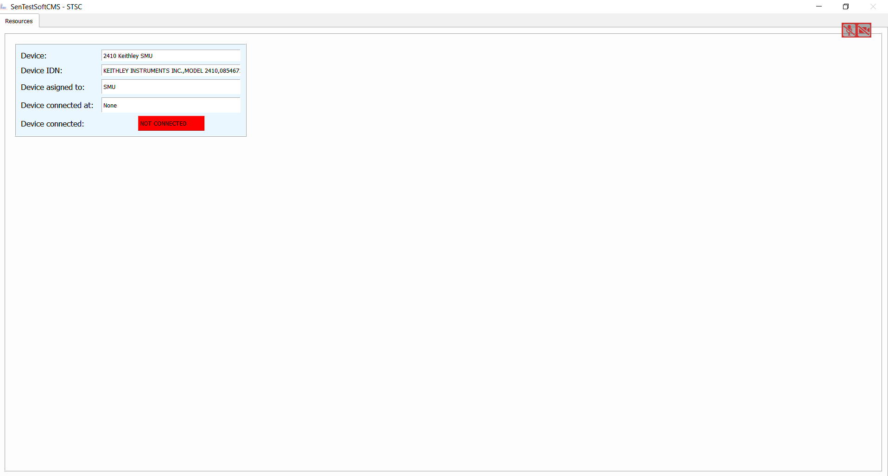

Tutorials
=========

This tutorials should guide you through the process of generating your own customized GUI and measurement routines.
But before we can start download the blank project from the "tutorial" branch from the git repository as described in :ref:`installation`.
Or, delete all previous existing GUI elements and so on from a working suite.
To do that delete the content of the following folders, except for the ``__init__.py`` files.

- .init/devices
- .init/defaults
- .init/Pad_files
- .modules/QT_Designer_UI
- .modules/ui_plugins

this makes a *tabula rasa* for your project

the first thing we need now is a complete new ``defaults.yaml`` file, which is needed by the framework.
I have set up one for you here, you can simply copy it ::

    --- # Block of dict entries

    # Critical parameters
    Settings_name: Defaults # The name of the settings which will be shown in the framework and will be the addressing name
    Operator: # The operators working on this machine
      - You

    Projects: # The project names of your sensor batches etc. musst be conform with the sensors entries
        - Test Project

    measurement_order:
        - IVscan

    # Optional parameters

    GUI_render_order: # Give a render order if need be, otherwise all found gui elements will be rendered
        - Main

    # Devices aliases for internal use, the key will then be the frameworks internal representation and the value is the display name
    IVSMU: Bias_SMU

This file needs to be saved in ``.init/defaults`` and it is written in YAML (json works as well).

When you now try to run the program via ::

    python UniDAQ.py

you should get an empty GUI window with nothing in it.

This is the start point for the rest of these tutorials

.. note:: I recommend to download a working copy from the git repository branch "tutorial", since this will definetely work.

How to add a new GUI element
----------------------------

Your program has now no GUI at all, if its want you wanted: Awesome. If not, we ought to change that.
In order to do so we need to design a GUI.

UniDAQ can work with **QTDesigner** ``.ui`` files.
With the :ref:`installation` of this software, which you have followed I hope, the so-called QtDesigner was installed as well.
If features a simple GUI based program, in which you can generate your own GUI and save them in ``.ui`` format.

.. note:: I will not go into details on how you build GUIs in QtDesigner, there are plenty of tutorial videos in the web.

You know can build your own GUI, or you use one of mine. I have precoded a minimal example of an IV GUI, you can find it in the ``tutorial_templates`` folder.
Now I will use this ``Main.ui`` file from this folder.

Put the file in: ``.modules/QT_Designer_UI``

Next we have to tell the Program to render this UI and in which order (when you have more than one UI). Open the ``**defaults.yml**``
file from before and add in the parameter ``GUI_render_order`` with a value of "Main".

Know we have to write some code so that the this UI has some logic. For this we generate a file in the folder ``.modules/ui_plugins``.
This file we call ``Main_window.py``.

.. note:: A final minimal example can also be found in the ``tutorials_templates`` folder.

The minimal example to run just the GUI without anything else is as follows: ::

    from PyQt5 import QtGui
    from PyQt5.QtGui import *
    from PyQt5.QtWidgets import *
    from .. import utilities

    # Logger and utilities
    # Adds the logger object to the namespace
    l = logging.getLogger(__name__)
    # Adds the utilitifunctions to the namespace
    hf = utilities.help_functions()

    class <GUI_name>_window:
        def __init__(self, GUI_classes, layout):
            self.variables = GUI_classes    # Containing all variables and methods from the parent class for example the state machine
            self.layout = layout            # The layout class in which will be rendered

            # Loading the UI plugin
            <GUI_name>_widget = QWidget()
            self.<GUI_name> = self.variables.load_QtUi_file("./modules/QT_Designer_UI/<name_of_ui_file.ui>", <GUI_name>_widget)
            self.layout.addWidget(<GUI_name>_widget)

In our case **<GUI_name>** would be **Main_window.py** and **<name_of_ui_file.ui>** would be **Main.ui**.
After that it renders the GUI when you restart UniDAQ. But this code does not have and logic to it. You can add python
member functions to it and access the ui classes e.g. buttons and so on via ``<GUI_name>.foo()`` etc.

In **Main.window.py** are some predefined functions which give the GUI some logic for a simple IV measurement. Go check it out!

If you restart UniDAQ you should see a window tab called "Main". Wow, what an achievement!

Now that we know how to add some GUI elements to our program we can proceed and add some devices too.

How to add a new device
-----------------------

Before we start with this tutorial be so kind and add the GUI **Resources.ui** and the respective ``.py`` from the templates.
This will give you some feedback if a certain device is correctly connected to the framework or not. If you don't know how to add a GUI element to the framework, be sure to have done the previous tutorial point.

Now that we have a GUI which can display all devices in the framework, we should add a device and see what happens.
To do that go into the folder ``.init/devices`` and create a .yml file. The name of this file has no particular important
meaning to the framework. But to keep it all simples lets choose the name like whats the device called e.g. ``Keithley2410.yml``.

This file need the following entries, where the values of the key,value pairs is one of your choosing but the key is fixed: ::

    {
        "Device_name": "2410 Keithley SMU",
        "Device_type": "SMU",
        "Display_name": "SMU1",
        "Device_IDN": "KEITHLEY INSTRUMENTS INC.,MODEL 2410,0854671,C33   Mar 31 2015 09:32:39/A02  /J/H"
    }

All other entries are your choosing, key and value. You only have to remember them later on for the measurements.

- *Device_name*: Is a name you can give the Device for internal Display
- *Device_type*: Specifies the decvice
- *Display_name*: Is the name for internal reference (only value which has to be different for all devices)
- *Device_IDN*: Specifies the devices own IDN

UniDAQ has the feature to run an initialization proceedure over a device, when the software boots up. In order to use
this feature a format has to be considered for the keys in the dictionary.

If a key has the prefix ``default_`` it will be executed during initialization. If the additional prefix ``imp:`` is stated
then this command will be executed before all other commands. Each ``default_`` needs to have a ``set_`` value to work (but not the other way round).
Out of both a command will be build.

Lets see an example to clarify. Imagine you want to initialize the instrument with voltage 0: ::

    {
        "set_voltage": "SOUR:VOLT:LEV ",
        "default_voltage": "0"
    }

The command which will be send to the device will be *SOUR:VOLT:LEV 0*.

.. note:: If you add the item ``"<alias_name>": "<Display_name>"`` to your *defaults.yml* file you can rename the device internally, think of it like a internal, consistent notation.

Now that you have added all crucial commands for a device save it and restart UniDAQ, the result should look like

.. note:: If you want a more detailed example, there is a full device configuration for a Keithley 2410 SMU in the templates folder.

In a very short time we have achieved a lot, woudn' ya say? You now can add as many GUI elements and devices as you want and also add
the logic to it.

I would recommend to keep the code you have written now. It may come handy to know what and how many devices are defined/connected
to the framework.

Furthermore, I would recommend to add further GUI elements from the repo, especially the "Data_Browser" will come in handy.
With it you can browse all yml files (and more) you have just created. Furthermore, you can manipulate, add and save the data
easily.

How to add a new measurement
----------------------------

In this final tutorial I will show you how to add a measurement plugin as easily as the GUI plugins from the previous section.
In order to not program a full GUI, please add the GUI elements **Main_window.py** as shown in the previous tutorials.

First you need to implement a "Project", this can be done if you open a new directory in ``.init/Pad_files``, where
the directory name resembles a "Project". If you have downloaded the turorial branch, then there should be a project already in there.
In this project you find a txt file, which resembles a pad file. Such a file includes information about a specific sensor. In this case a
strip sensor. If you do not include xyz coordinates, such a file can be used as header information file, instead of an strip file.

For completeness reasons I show you now such a pad file and how it generally looks like ::

   # This pad file is for the HPK irradiation sensor for the 6inch runs

   Campaign: Hamamatsu 6inch Irradiation
   Creator: Dominic Bloech 17.07.2018

   reference pad: 1
   reference pad: 32
   reference pad: 64

   # Additional parameters
   implant_length: 20036
   metal_width: 35
   implant_width: 22
   metal_length: 19332.35
   pitch: 90
   thickness: 240
   type: p-type

   strip	x	y	z
   1	    0	0	0
   2	    0	90	0
   3	    0	180	0
   4	    0	270	0
   5	    0	360	0
   6	    0	450	0
   7	    0	540	0
   8	    0  	630	0
   9	    0	720	0
   10	    0	810	0
   11	    0	900	0
   12	    0	990	0
   13	    0	1080	0
   14	    0	1170	0

In order for them to work you have to add a few items into the **defaults.yml** file, so please add ::

   Operator:
      - Your Name

   Projects: # The project names of your sensor batches etc. musst be conform with the sensors entries
        - Test Project

   Sensor_types: # Different sensor types in the various projects
       Test Project:
            - Irradiation

   measurement_types: # If this is prevalent, measurements can be added, these are the objects in which the measurement data can be stored.
      - IV

With this you should be able to start UniDAQ again. (All these parameters are included in the tutorials default file)

.. warning:: Since we have only a fracture of the original program loaded, the program can experience some instabilities and crashes. Especially all table controls are susceptiple! So do not touch them, yet.

Now comming to the fun part. Coding the actual measurement proceedure for a IV curve.
Like it was with the other parts of this tutorial, adding a new measurement can be done via plugins.
Simply add a <name_of_your_measurement>.py file into the folder ``~/modules/measurement_plugins`` and the program knows this measurement.

A simple IV measurement plugin can already be found in this folder.

.. code-block:: python
   :linenos:

   # This file conducts a simple IV measurement

   import logging
   import sys
   import numpy as np
   sys.path.append('../modules')
   from ..VisaConnectWizard import *
   from ..utilities import *
   l = logging.getLogger(__name__)

   help = help_functions()
   vcw = VisaConnectWizard.VisaConnectWizard()

   @help.timeit # Decorator for timing of a function (not crucial)
   class IV_class: # Every measurement muss have a class named after the file AND the suffix '_class'

       def __init__(self, main_class):
           # Here all parameters can be definde, which are crucial for the module to work, you can add as much as you want
           self.main = main_class # Import the main parameters and functions
           self.justlength = 24 # paramerter for the writting to file
           time = self.do_IV() # Starts the measurement

       def stop_everything(self):
           """Stops the measurement, by sending a signal to the main loop, via a queue object"""
           order = {"ABORT_MEASUREMENT": True}
           self.main.queue_to_main.put(order)

       @help.timeit
       def do_IVCV(self):
           '''This function conducts an IV measurements'''
           voltage_End = None
           voltage_Start = None
           voltage_steps = None
           bias_SMU = self.main.devices["IVSMU"]

           # Defining the min/max/steps for the meausrement
           voltage_End.append(self.main.job_details["IV"].get("EndVolt", 0))
           voltage_Start.append(self.main.job_details["IV"].get("StartVolt", 0))
           voltage_steps.append(self.main.job_details["IV"].get("Steps", 0))

           # Add the fileheader
           if self.main.save_data:
               self.main.write(self.main.measurement_files["IV"], self.main.job_details["IV"]["header"] + "\n") # writes correctly the units into the file

           # Generates a voltagestep list
           voltage_step_list = self.main.ramp_value(voltage_Start, voltage_End, voltage_steps)

           # Config the setup for IV
           complience = str(self.main.job_details["IV"].get("Complience", "50e-6"))
           self.main.config_setup(bias_SMU, [("set_complience_current", complience)])
           self.main.change_value(bias_SMU, "set_output", "1")

           # Loop over all voltages which should be conducted
           for i, voltage in enumerate(voltage_step_list):
               if not self.main.stop_measurement(): # To shut down if necessary
                   self.main.change_value(bias_SMU, "set_voltage", str(voltage))
                   self.main.settings["Defaults"]["bias_voltage"] = voltage  # changes the bias voltage in the state machine
                   if not self.main.steady_state_check(bias_SMU, max_slope = 1e-6, wait = 0, samples = 5, Rsq = 0.5, complience=complience): # Is a dynamic waiting time for the measuremnts
                       self.stop_everything()

                   if self.main.check_complience(bias_SMU, float(complience)):
                       self.stop_everything() # stops the measurement if complience is reached

                   string_to_write = ""
                   I, V = self.do_IV(voltage, bias_SMU, samples = 3)
                   if self.main.save_data:
                       string_to_write += str(I).ljust(self.justlength) + str(V).ljust(self.justlength)

                   self.main.write(self.main.measurement_files["IVCV"], string_to_write + "\n")  # writes correctly the units into the fileself.main.IVCV_file, string_to_write)

               elif self.main.stop_measurement(): # Stops the measurement if necessary
                   break

           if self.main.save_data: # Closes the file after completion of measurement or abortion
               help.close_file(self.main.IVCV_file)

           # After the measurement ramp down and switch of the SMU
           self.main.ramp_voltage(bias_SMU, "set_voltage", str(voltage_step_list[i-1]), 0, 20, 0.01)
           self.main.change_value(bias_SMU, "set_voltage", "0")
           self.main.change_value(bias_SMU, "set_output", "0")

           return None

       #@help.timeit
       def do_IV(self, voltage, device_dict, samples = 5):
           '''This function simply sends a request for reading a current value and process the data'''
           if not self.main.stop_measurement():
               if not self.main.steady_state_check(device_dict, max_slope=1e-6, wait=0, samples=4,Rsq=0.5, complience=self.main.job_details["IVCV"]["IV"]["Complience"]):  # Is a dynamic waiting time for the measuremnt
                   self.stop_everything()
                   l.warning("Steady state could not be reached, shutdown of measurement")
                   return
               values = []
               for i in range(samples):
                   command = self.main.build_command(device_dict, "Read") # returns 2 values!!!
                   values.append(str(vcw.query(device_dict, command)).split("\t"))

               current = sum([float(x[0]) for x in values])/len(values) # Makes a mean out of it
               voltage = sum([float(x[1]) for x in values]) / len(values)  # Makes a mean out of it

               self.main.settings["Defaults"]["bias_voltage"] = voltage  # changes the bias voltage of the sate machine

               self.main.measurement_data["IV"][0] = np.append(self.main.measurement_data["IV"][0], [float(voltage)])
               self.main.measurement_data["IV"][1] = np.append(self.main.measurement_data["IV"][1],[float(current)])
               self.main.queue_to_main.put({"IV": [float(voltage), float(current)]})

               return (current, voltage)

.. note:: The mechanics and functions behind the actual measurement procedure is quiet big. Therefore, I will only talk about the here programmed example but note that the framework gives you a ton of functions to work with for measurement algorithm development. Please see for the deticated tutorial on that.

So lets go through this program in detail:

.. code-block:: python

   import logging
   import sys
   import numpy as np
   sys.path.append('../modules')
   from ..VisaConnectWizard import *
   from ..utilities import *
   l = logging.getLogger(__name__)

   help = help_functions()
   vcw = VisaConnectWizard.VisaConnectWizard()

   @help.timeit # Decorator for timing of a function (not crucial)
   class IV_class: # Every measurement muss have a class named after the file AND the suffix '_class'

Here basic modules are loaded, you are not restricted to them. You can add and remove as much as you like.

.. code-block:: python

   @help.timeit # Decorator for timing of a function (not crucial)
   class IV_class: # Every measurement muss have a class named after the file AND the suffix '_class'

Here the measurement class is initialized. It is important, that the class declaration has the same name as the file
plus the suffix ``_class``. So, lets say you want the measurement **stripscan**. Just generate a python file with name
``stripscan.py`` and declare the class

.. code-block:: python

   class stripscan_class:

.. code-block:: python

   def __init__(self, main_class):
       # Here all parameters can be definde, which are crucial for the module to work, you can add as much as you want
       self.main = main_class # Import the main parameters and functions
       self.justlength = 24 # paramerter for the writting to file
       time = self.do_IV() # Starts the measurement

Here the init function of the class is defined. Make sure the init function does all the work, so when the interpreter jumps
out of the module, the desired measurement was conducted.

.. code-block:: python

   def stop_everything(self):
      """Stops the measurement, by sending a signal to the main loop, via a queue object"""
      order = {"ABORT_MEASUREMENT": True}
      self.main.queue_to_main.put(order)

This function is a message function to the main loop of the framework. If you put the on the ``queue_to_main``. This message
will be interpreted by the framework as a deep core directive/message. There are a lot of different messages you can send
see the chapter about **data exchange** in the Framework for that.

.. code-block:: python

   @help.timeit
    def do_IVMain(self):
        '''This function conducts an IV measurements'''
        voltage_End = None
        voltage_Start = None
        voltage_steps = None
        bias_SMU = self.main.devices["IVSMU"]

        # Defining the min/max/steps for the meausrement
        voltage_End.append(self.main.job_details["IV"].get("EndVolt", 0))
        voltage_Start.append(self.main.job_details["IV"].get("StartVolt", 0))
        voltage_steps.append(self.main.job_details["IV"].get("Steps", 0))

        # Add the fileheader
        if self.main.save_data:
            self.main.write(self.main.measurement_files["IV"], self.main.job_details["IV"]["header"] + "\n") # writes correctly the units into the file

        # Generates a voltagestep list
        voltage_step_list = self.main.ramp_value(voltage_Start, voltage_End, voltage_steps)

        # Config the setup for IV
        complience = str(self.main.job_details["IV"].get("Complience", "50e-6"))
        self.main.config_setup(bias_SMU, [("set_complience_current", complience)])
        self.main.change_value(bias_SMU, "set_output", "1")

        # Loop over all voltages which should be conducted
        for i, voltage in enumerate(voltage_step_list):
            if not self.main.stop_measurement(): # To shut down if necessary
                self.main.change_value(bias_SMU, "set_voltage", str(voltage))
                self.main.settings["Defaults"]["bias_voltage"] = voltage  # changes the bias voltage in the state machine
                if not self.main.steady_state_check(bias_SMU, max_slope = 1e-6, wait = 0, samples = 5, Rsq = 0.5, complience=complience): # Is a dynamic waiting time for the measuremnts
                    self.stop_everything()

                if self.main.check_complience(bias_SMU, float(complience)):
                    self.stop_everything() # stops the measurement if complience is reached

                string_to_write = ""
                I, V = self.do_IV(voltage, bias_SMU, samples = 3)
                if self.main.save_data:
                    string_to_write += str(I).ljust(self.justlength) + str(V).ljust(self.justlength)

                self.main.write(self.main.measurement_files["IVCV"], string_to_write + "\n")  # writes correctly the units into the fileself.main.IVCV_file, string_to_write)

            elif self.main.stop_measurement(): # Stops the measurement if necessary
                break

        if self.main.save_data: # Closes the file after completion of measurement or abortion
            help.close_file(self.main.IVCV_file)

        # After the measurement ramp down and switch of the SMU
        self.main.ramp_voltage(bias_SMU, "set_voltage", str(voltage_step_list[i-1]), 0, 20, 0.01)
        self.main.change_value(bias_SMU, "set_voltage", "0")
        self.main.change_value(bias_SMU, "set_output", "0")

        return None

Here the actual background tasks for the IV curve are programmed. It shouldn't be hard to decifer it, to understand howe it works.

One important part is the object ``self.main.job_details``. This object contains all information about the sended job from the main framework.
Think of it as a cook recipe for your measurement.

.. warning:: The ``self.main.job_details`` has no fixed size or naming. The content should follow basic rules described in the **measurement generation** topic, though.

.. code-block:: python

   # Add the fileheader
   if self.main.save_data:
       self.main.write(self.main)

Here the header will be written to a file, if you specified the option (default).

.. code-block:: python

   # Generates a voltagestep list
   voltage_step_list = self.main.ramp_value(voltage_Start, voltage_End, voltage_steps)

Now coming to one of the most important parts of the framework. The framework gives you a ton of build in functions and variables to work with.
All of them can be accessed via the object ``self.main`` (if correctly stated in the init function).
These functions can be used to automatise some task, which are usually need by a user. One of these functions is ``ramp_value``.
This function takes a start, end and step value and returns you a list, of values.

.. note:: For more information on these functions and how they work, see the reference manual or the corresponding topic in this doc.

.. code-block:: python

   def do_IV(self, voltage, device_dict, samples = 5):
           '''This function simply sends a request for reading a current value and process the data'''
           if not self.main.stop_measurement():
               if not self.main.steady_state_check(device_dict, max_slope=1e-6, wait=0, samples=4,Rsq=0.5, complience=self.main.job_details["IVCV"]["IV"]["Complience"]):  # Is a dynamic waiting time for the measuremnt
                   self.stop_everything()
                   l.warning("Steady state could not be reached, shutdown of measurement")
                   return
               values = []
               for i in range(samples):
                   command = self.main.build_command(device_dict, "Read") # returns 2 values!!!
                   values.append(str(vcw.query(device_dict, command)).split("\t"))

               current = sum([float(x[0]) for x in values])/len(values) # Makes a mean out of it
               voltage = sum([float(x[1]) for x in values]) / len(values)  # Makes a mean out of it

               self.main.settings["Defaults"]["bias_voltage"] = voltage  # changes the bias voltage of the sate machine

               self.main.measurement_data["IV"][0] = np.append(self.main.measurement_data["IV"][0], [float(voltage)])
               self.main.measurement_data["IV"][1] = np.append(self.main.measurement_data["IV"][1],[float(current)])
               self.main.queue_to_main.put({"IV": [float(voltage), float(current)]})

               return (current, voltage)

Here the loop over the voltage list is conducted, using build-in functions from the framework.
The only interesting part is, when it calls the ``do_IV(...)`` function. The purpose of this function is to simply accuire a value
from a device. Here an algorithm was used to mitigate noise effects. Furthermore, the aquiered data is put in objects provided by the framework
to safely store the measured data, even if the script is crashing (``self.main.measurement_data["IV"]``).

.. warning:: This automated storage generation will only work, if you have stated the measurement in the defaults file under the parameter ``measurement_types``.